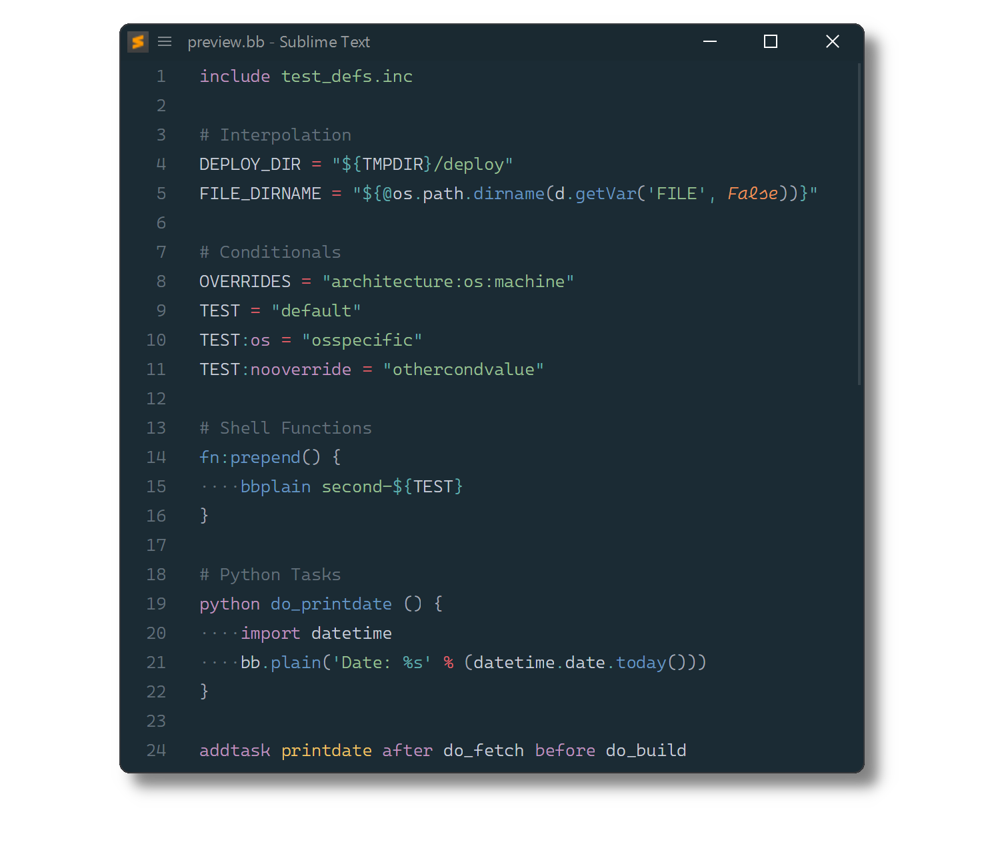

# BitBake

[BitBake](https://docs.yoctoproject.org/bitbake) syntax definitions for [Sublime Text](https://www.sublimetext.com).

## Installation

### Package Control

The easiest way to install is using [Package Control](https://packagecontrol.io). It's listed as `BitBake`.

1. Open `Command Palette` using <kbd>ctrl+shift+P</kbd> or menu item `Tools → Command Palette...`
2. Choose `Package Control: Install Package`
3. Find `BitBake` and hit <kbd>Enter</kbd>

### Manual Install

1. Download appropriate [BitBake.sublime-package](https://github.com/SublimeText/BitBake/releases).
2. Copy it into _Installed Packages_ directory

> [!NOTE]
>
> To find _Installed Packages_...
>
> 1. call _Menu > Preferences > Browse Packages.._
> 2. Navigate to parent folder
